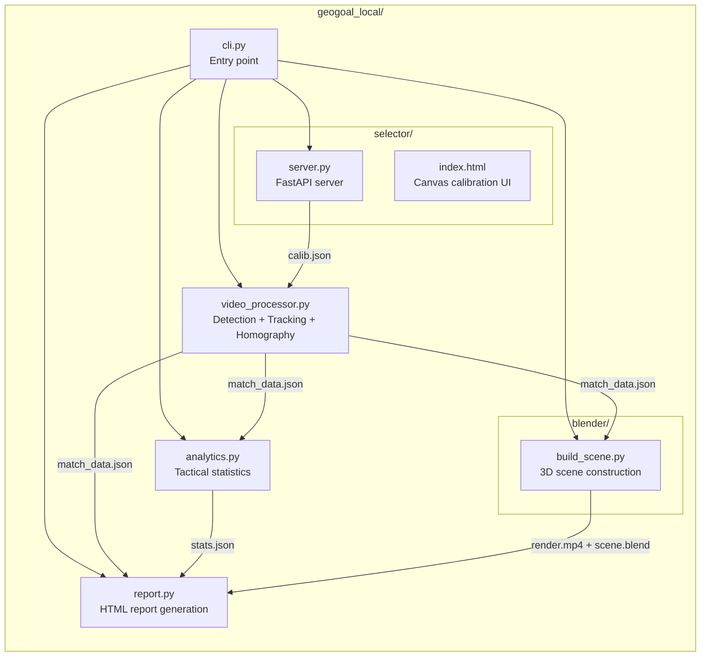
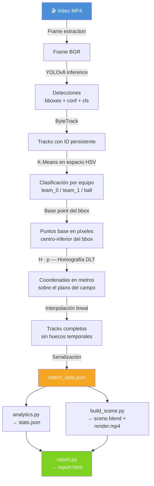
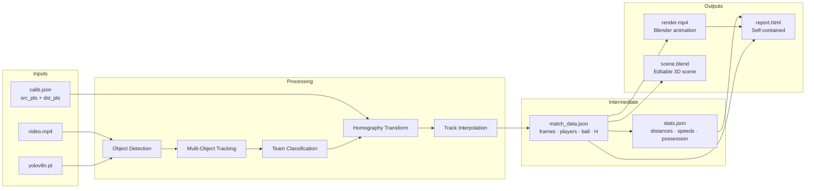

# Geo-Goal Local — Architecture

## System Architecture

```mermaid
graph LR
    subgraph geogoal_local ["geogoal_local/"]
        CLI[cli.py<br/>Entry point]
        VP[video_processor.py<br/>Detection + Tracking + Homography]
        AN[analytics.py<br/>Tactical statistics]
        RP[report.py<br/>HTML report generation]

        subgraph selector ["selector/"]
            SV[server.py<br/>FastAPI server]
            IDX[index.html<br/>Canvas calibration UI]
        end

        subgraph blender ["blender/"]
            BS[build_scene.py<br/>3D scene construction]
        end
    end

    CLI --> VP
    CLI --> SV
    CLI --> AN
    CLI --> RP
    CLI --> BS

    VP -->|match_data.json| AN
    VP -->|match_data.json| RP
    AN -->|stats.json| RP
    VP -->|match_data.json| BS
    BS -->|render.mp4 + scene.blend| RP
    SV -->|calib.json| VP
```

## Pipeline Flow

```mermaid
flowchart TD
    V[🎬 Video MP4] -->|Frame extraction| FE[Frame BGR]
    FE -->|YOLOv8 inference| DET[Detecciones<br/>bboxes + conf + cls]
    DET -->|ByteTrack| TRK[Tracks con ID persistente]
    TRK -->|K-Means en espacio HSV| CLS[Clasificación por equipo<br/>team_0 / team_1 / ball]
    CLS -->|Base point del bbox| BP[Puntos base en píxeles<br/>centro-inferior del bbox]
    BP -->|H · p — Homografía DLT| PROJ[Coordenadas en metros<br/>sobre el plano del campo]
    PROJ -->|Interpolación lineal| INT[Tracks completos<br/>sin huecos temporales]
    INT -->|Serialización| JSON[match_data.json]

    JSON --> STATS[analytics.py<br/>→ stats.json]
    JSON --> BL[build_scene.py<br/>→ scene.blend + render.mp4]
    STATS --> HTML[report.py<br/>→ report.html]
    BL --> HTML

    style V fill:#4a90d9,color:#fff
    style JSON fill:#f5a623,color:#fff
    style HTML fill:#7ed321,color:#fff
```

## Data Flow

```mermaid
flowchart LR
    subgraph Inputs
        VIDEO[video.mp4]
        CALIB[calib.json<br/>src_pts + dst_pts]
        MODEL[yolov8n.pt]
    end

    subgraph Processing
        direction TB
        DETECT[Object Detection]
        TRACK[Multi-Object Tracking]
        CLASSIFY[Team Classification]
        HOMOG[Homography Transform]
        INTERP[Track Interpolation]
    end

    subgraph Intermediate
        MATCH[match_data.json<br/>frames · players · ball · H]
        STATSF[stats.json<br/>distances · speeds · possession]
    end

    subgraph Outputs
        REPORT[report.html<br/>Self-contained]
        RENDER[render.mp4<br/>Blender animation]
        SCENE[scene.blend<br/>Editable 3D scene]
    end

    VIDEO --> DETECT
    MODEL --> DETECT
    DETECT --> TRACK
    TRACK --> CLASSIFY
    CALIB --> HOMOG
    CLASSIFY --> HOMOG
    HOMOG --> INTERP
    INTERP --> MATCH

    MATCH --> STATSF
    MATCH --> RENDER
    MATCH --> SCENE
    STATSF --> REPORT
    RENDER --> REPORT
    MATCH --> REPORT
```
